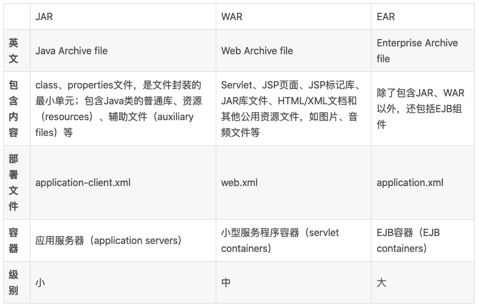
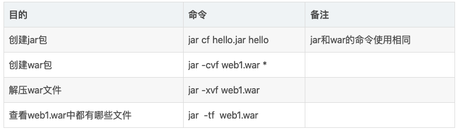

**jar包**：与平台无关的文件格式，它允许将都铎文件组合成一个压缩文件。**javaSE程序可以打包成jar包*

JAR文件格式以流行的ZIP文件格式为基础。与ZIP不同的是，JAR文件不仅用于压缩和发布，而且还用于部署和封装库、组件、插件程序，并可被像编译器和JVM这样的工具直接使用。

简单来说，java编译好之后生成class文件，但如果直接发布这些class文件的话会很不方便，所以把许多class文件打包成一个jar，jar中除了class文件还包括一些资源与配置文件，通常一个jar包就是一个java程序或者一个java库。可以将这些jar包已进入到你的项目中，可以直接使用这些包中的类和属性，这些jar包一般放到lib目录下。

**war包**：war包与jar包基本相同，它通常是一个java的web应用程序的包，是一个可以直接运行的web模块。通常用于网站，打成包部署到容器中。以tomcat来说，将war包放置在webapps目录下，然后启动tomcat，这个包就会自动解压，就相当于发布了。tomcat这种Servlet容器会认出war包并自动部署。

war包中的文件按照一定目录结构来组织。其根目录下包含有html和jsp文件，或者包含这两种文件的目录，另外还有WEB-INF目录。通常在WEB-INF目录下含有一个web.xml文件和一个classes目录，web.xml是这个应用的配置文件，而classes目录下则包含编译好的servlet类和jsp，或者servlet所依赖的其他类（如 javaBean）。通常这些所依赖的类也可以打包成jar包放到WEB-INF的lib目录下

简单来说，war包是Javaweb程序打的包，war包里面包括写的代码编译成的class文件，依赖的包，配置文件，所有的网站页面，包括html，jsp等等，一个war包可以理解为一个web项目，里面是项目的所有东西

**区别**

war文件代表web应用程序，jar是类的归档文件。

所有的包都是用jar打的，只不过目标文件的扩展名不一样

**常用命令**

jar命令格式：jar{ctxuf}[vMeOmi] [-C目录] 文件名

其中{ctvu}这四个参数必须选择其一，[vMeOmi] 是可选参数，文件名也必须。

- -c：创建一个jar包

- -t：显示jar包中的内容列表

- -x：解压jar包

- -u：添加文件到jar包中

- -f：指定jar包的文件名

  ------

- -v：生成相似的报告，并输出至标准设备
- -m：指定mmanifast.mf文件（manifast.mf文件中可以对jar包及其中的内容做一些设置）
- -O：产生jar包时不对其中的内容压缩处理
- -M：不产生所有文件的清单文件（manifast.mf）。这个参数与护目摁掉-m参数的设置相反
- -i：为指定的jar文件创建索引文件
- -C：标识转到响应的目录下执行jar命令，相当于cd到那个目录，然后不带-C执行jar命令

##### idea中导入jar包

https://blog.csdn.net/hwt1070359898/article/details/90517291