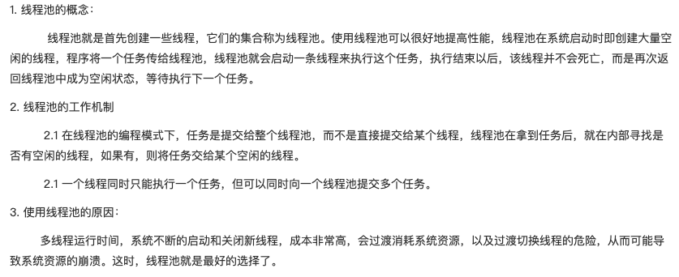

## 一、线程池简介



## 二、四种常见线程池详解

#### 线程池的返回值ExecutorService简介：

ExecutorService是Java提供的用于管理线程池的类。该类的两个作用：控制线程数量和重用线程

#### 固定线程数的线程池（newFixedThreadPool）

```java
package com.ThreadPool;

import java.util.concurrent.ExecutorService;
import java.util.concurrent.Executors;

public class NewFixThreadPoolTest {
    public static void main(String[] args) {

        //创建一个可缓存线程池
        ExecutorService fixedThreadPool = Executors.newFixedThreadPool(3);

        for (int i = 0; i < 10; i++) {

            fixedThreadPool.execute(new Runnable() {
                @Override
                public void run() {

                    try {
                        System.out.println(Thread.currentThread().getName() + "(" + Thread.currentThread().getId() + ") 正在被执行");
                        Thread.sleep(2000);
                    } catch (InterruptedException e) {
                        e.printStackTrace();
                    }
                }
            });


        }
        //结束线程
        fixedThreadPool.shutdown();


    }
}

```

------

#### 可缓存线程池

####  Executors.newCacheThreadPool()：可缓存线程池，先查看池中有没有以前建立的线程，如果有，就直接使用。如果没有，就建一个新的线程加入池中，缓存型池子通常用于执行一些生存期很短的异步型任务

```java
package com.ThreadPool;

import java.util.concurrent.ExecutorService;
import java.util.concurrent.Executors;

public class NewCachedThreadPoolTest {
    public static void main(String[] args) {

        //创建一个可缓存线程池
        ExecutorService cachedThreadPool = Executors.newCachedThreadPool();

        for (int i = 0; i < 10; i++) {
            try {
                //sleep 可明显看到使用的线程池里面以前的线程，没有创建新线程
                Thread.sleep(1000);
            } catch (InterruptedException e) {
                e.printStackTrace();
            }

            cachedThreadPool.execute(new Runnable() {
                @Override
                public void run() {

                    //打印正在执行的缓存线程信息
                    System.out.println(Thread.currentThread().getName() + "(" + Thread.currentThread().getId() + ") 正在被执行");

                    try {
                        Thread.sleep(1000);
                    } catch (InterruptedException e) {
                        e.printStackTrace();
                    }
                }
            });

        }
        //结束线程
        cachedThreadPool.shutdown();
    }
}

```

线程池为无限大，当执行当前任务时上一个任务已经完成，会复用执行上一个任务的线程，而不用每次新建线程

------

#### Executors.newScheduledThreadPool(int n); 创建一个定长线程池，支持定时及周期性任务执行

```java
package com.ThreadPool;

import java.util.concurrent.ExecutorService;
import java.util.concurrent.Executors;
import java.util.concurrent.ScheduledExecutorService;
import java.util.concurrent.TimeUnit;

public class NewScheduledThreadPoolTest {
    public static void main(String[] args) {

        //创建一个定长线程池，支持定时及周期性任务执行--延时执行
        ExecutorService scheduledThreadPool = Executors.newScheduledThreadPool(5);

        //延时1秒后每3秒执行一次
        ((ScheduledExecutorService) scheduledThreadPool).scheduleAtFixedRate(new Runnable() {
            @Override
            public void run() {
                System.out.println(Thread.currentThread().getName() + "(" + Thread.currentThread().getId() + ") 正在被执行");
                System.out.println("延时1秒后每3秒执行一次");
            }
        }, 1, 3, TimeUnit.SECONDS);


    }
}

```

#### Execufors.newSingleThreadExecutor();创建一个单线程化的线程池，它只会用唯一的工作线程来执行任务，保证所有任务按照指定顺序（FIFO，LIFO，优先级）执行。

```java
package com.ThreadPool;

import java.util.concurrent.ExecutorService;
import java.util.concurrent.Executors;
import java.util.concurrent.ScheduledExecutorService;
import java.util.concurrent.TimeUnit;

public class NewSingleThreadPoolTest {
    public static void main(String[] args) {

        //创建一个单线程话的线程池
        ExecutorService singleThreadExecutor = Executors.newSingleThreadExecutor();


        for (int i = 0; i < 10; i++) {
            final int index = i;
            singleThreadExecutor.execute(new Runnable() {
                @Override
                public void run() {

                    try {
                        System.out.println(Thread.currentThread().getName() + "(" + Thread.currentThread().getId() + ") 正在被执行,打印的值是：" + index);
                        Thread.sleep(5000);
                    } catch (InterruptedException e) {
                        e.printStackTrace();
                    }
                }
            });

        }

        singleThreadExecutor.shutdown();

    }
}

```

## 三、缓冲队列BlockingQueue和自定义线程池ThreadPoolExecutor

- 缓冲队列BlockingQueue简介：

BlokingQueue是双缓冲队列。BlockingQueue内部使用两条队列，允许两个线程同时向队列一个存储，一个取出操作。在保证并发安全的同时，提高了队列的存取效率。

- 常见的集中BlockingQueue：

  - ArrayBlockingQueue(int i) ：规定大小的BlockingQueue，其构造必须制定大小。其所包含的对象是FIFO顺序排序的。
  - LinkedBlockingQueue()或(int i)：大小不固定的BlockingQueue，若其构造时指定大小，生成的BlockingQueue有大小限制，不指定大小，其大小有Integer.MAX_VALUE来决定，其所含的对象是FIFO顺序排序的。
  - PriorityBlocking() 或(int i)：类似于LinkedBlockingQueue，但是其所含对象的排序不是FIFO，而是根据对象自然顺序或者构造函数的Comparator决定。
  - SynchronizedQueued()：特殊的BlockingQueue,对其的操作必须是放和取交替完成

- 自定义线程池（ThreadPoolExecutor和BlockingQueue连用）：

  - 自定义线程池可以使用ThreadPoolExecutor类创建，它有多个构造方法来创建线程池
  - 常见的构造函数：ThreadPoolExecutor(int corePoolSize,int maximumPoolSize,long keepAliveTime,TimeUnit unit,BlockingQueue<Runnable> workQueue)

  ```java
  package com.ThreadPool;
  
  import java.util.concurrent.ArrayBlockingQueue;
  import java.util.concurrent.BlockingQueue;
  import java.util.concurrent.ThreadPoolExecutor;
  import java.util.concurrent.TimeUnit;
  
  public class ZiDIngYiThreadPoolExecutor {
  
      public static class TempThread implements Runnable {
  
          @Override
          public void run() {
              //打印正在执行的缓存线程信息
              System.out.println(Thread.currentThread().getName() + "(" + Thread.currentThread().getId() + ") 正在被执行");
  
              try {
                  //sleep 一秒保证2个任务分别在3个线程上执行
                  Thread.sleep(3000);
              } catch (InterruptedException e) {
                  e.printStackTrace();
              }
          }
      }
  
      public static void main(String[] args) {
  
          //创建数组型数组缓冲队列
          BlockingQueue<Runnable> bq = new ArrayBlockingQueue<Runnable>(10);
  
          //ThreadPoolExecutor：创建自定义线程池，池中保存的线程数为3，允许最大的线程数为6
          ThreadPoolExecutor tpe = new ThreadPoolExecutor(3, 6, 50, TimeUnit.MILLISECONDS, bq);
  
          //创建6个任务
          Runnable t1 = new TempThread();
          Runnable t2 = new TempThread();
          Runnable t3 = new TempThread();
          Runnable t4 = new TempThread();
          Runnable t5 = new TempThread();
          Runnable t6 = new TempThread();
  
          //3个任务分别在3个线程上执行
          tpe.execute(t1);
          tpe.execute(t2);
          tpe.execute(t3);
          tpe.execute(t4);
          tpe.execute(t5);
          tpe.execute(t6);
  
          //关闭自定义线程池
          tpe.shutdown();
  
      }
  }
  
  ```

  